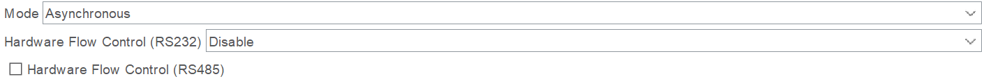
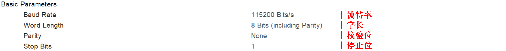
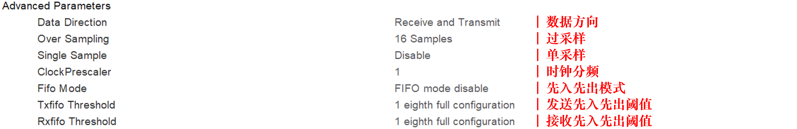

# 串口CUBEMX配置

## 基本配置

> - 串口模式：一般选择异步（Asynchronous）即可。
> - 硬件流控：在使用RS232或RS485时，用于半双工控制数据流向。

## 详细配置

#### 基础参数配置

> - 波特率：数据传输的速度，需与接收端相同
> - 字长：单次传输的数据位数
> - 校验位：是否对数据进行奇偶校验
> - 停止位：是否在数据位后添加停止位

#### 高级参数配置

> - 过采样：提高过采样值，可以提高波特率的精度，进而降低误码率。
> - 先入先出模式：可以将多次收到的串口数据储存，达到阈值后再触发中断处理。