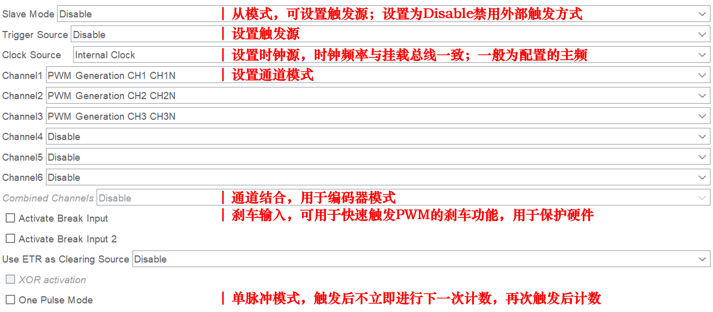
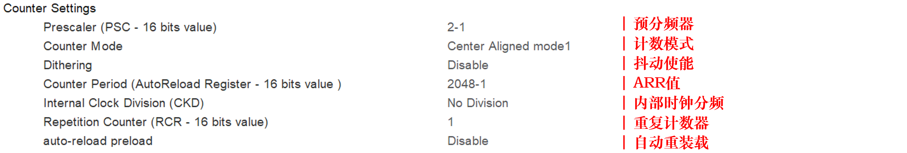
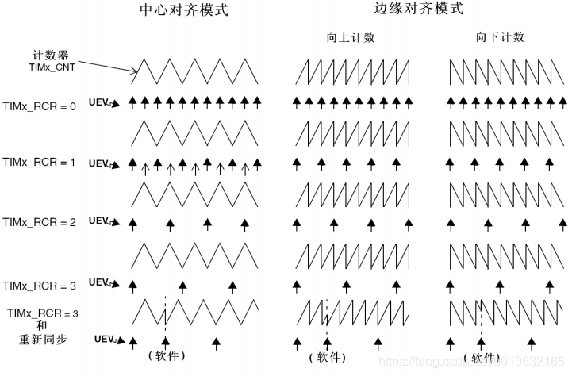
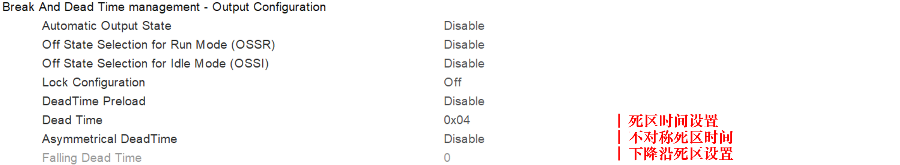
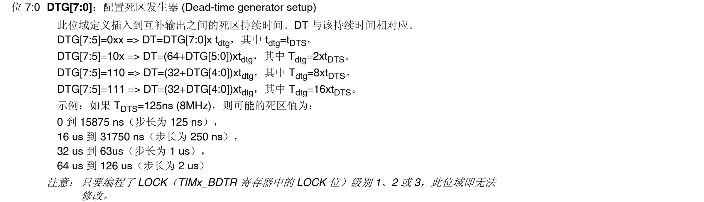
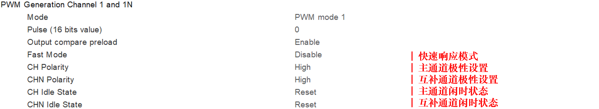

# 定时器CUBEMX配置

## 定时器模式与基本配置

在`CubeMX`中，以高级定时器为例，可供配置的项目如图

> - 通道模式选择是选择定时器通道的输出模式。常用模式包括：
>   - 输入捕获模式（Input Capture Mode）
>   - 输出比较模式（Output Compare Mode）
>   - 强制输出模式（Forced Output Mode）
>   - PWM生成模式（PWM Generation Mode）

下面介绍不同输出模式的详细配置。

## PWM生成模式详细配置

主要介绍三部分：定时器基础配置；PWM死区配置；PWM通道配置。

#### 定时器的基础设置

> - 预分频器：对输入的时钟进行分频，分频的比例为该寄存器的值加1。
>
> - 计数模式：定时器进行计时的方式，有三种计数方式：
>
>   - 递增计数模式（Up）：计数值由0计数至ARR装载值，产生上溢事件
>   - 递减计数模式（Down）：计数值由ARR装载值计数至0，产生下溢事件
>   - 中心对称模式（Center Aligned mode）：计数值0计数至ARR装载值，产生上溢事件，再由ARR装载值计数至0，产生下溢事件。在 Cube MX 中，存在三种中心对称模式，影响比较值匹配事件的触发（1-仅下降计数触发；2-仅上升计数触发；3-上升/下降计数均触发）。
>
> - ARR值：装载入自动重装载寄存器的值，决定了计数时间
>
> - 内部时钟分频：针对输入的时钟再次分频
>
> - **PWM频率计算方法**：$F_{PWM} = \frac{F_{CLK}}{(PSC + 1)*(ARR + 1)}$，若采用中心对称计数模式了，需要额外除以2。
>
> - 重复计数器：决定了溢出中断延迟的数量（0-不延迟；1-延迟半个计数周期；2-延迟一个计数周期）。
>
>   
>
> - 自动重装载预装载：决定了是否使用ARR的影子寄存器以保护ARR不被反复更改。

#### PWM死区配置

> - 死区时间设置：其实际为一个8位寄存器，决定了死区时间。死区时间计算如下：
>
>   
>
>   其中$t_{DTS}$为定时器的时钟周期，一般为时钟周期。
>
> - 不对称死区设置：可以单独设置上升沿和下降沿的死区大小 

#### PWM通道配置

> - 通道极性：决定了通道的有效电平，当主通道与互补通道相同时才能够生成互补PWM。
> - 快速响应模式：决定了CCR的改变是否在当周期即可应用于比较。
> - 闲时状态：决定了无PWM输出时通道引脚的电平状态。
